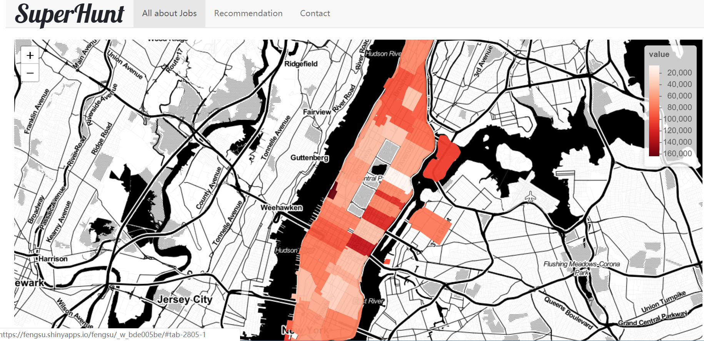

# Project 2: Shiny App Development Version 2.0

### [Project Description](doc/project2_desc.md)


## Project Title Lorem ipsum dolor sit amet
Term: Spring 2019

+ Team # 10
+ **Project title**: SuperHunt(https://fengsu.shinyapps.io/fengsu/)
	+ QianQian Wu
	+ Shaofu Wang
	+ Hui Chiang Tay
	+ Feng Su
	

+ **Project summary**:


This app is a job search engine which can provide customised recommendations based on skill sets and preferences for those who are interested in public service (government) in New York based on their preferences and skill sets. In this specific app, we employed comprehensive datasets such as NYC government jobs, NYC criminal and NYC transportation information. 

On the °± All about job°± map, the first impression a job seeker will get is the distribution of average NYC government salary throughout Manhattan. The deeper the color, the higher the salary and if users stop their mouse on the regions they are interested in, they will get more detailed information of this area. 
(zipcode and precise figure of average salary). 

On the °± Recommendation°± page, users can locate the jobs which fit them the best by setting the job categories, job type and skill sets within the salary range they can accept. Here, we used a double-sided slider which can identify the salary range more precisely. In addition, after job seekers locate the jobs which fit them the best, they can find job locations on the map with surrounding transportation or entertainment information, since the availability of transportation and recreation on a Friday night seem to be important as well for a job seeker. Finally, the user can further input their zipcode to calculate the time they need to reach the working area. 


+ **Contribution statement**: ([default](doc/a_note_on_contributions.md))
Data acquisition and manipulation: Everyone
Data integration(Acquitted data into one csv): Hui Chiang Tay, QianQian Wu
UI Design: Feng Su(mostly),QianQian Wu
Server-Recommendation page: Feng Su(mostly), Hui Chiang Tay(mostly), QianQian Wu, Shaofu Wang
Server-contact page: QianQian Wu(mostly), Shaofu Wang
Debug help: Hui Chiang Tay
Presentation: Shaofu Wang(mostly), Feng Su, Hui Chiang Tay, QianQian Wu
Github arrangement: Hui Chiang Tay


Following [suggestions](http://nicercode.github.io/blog/2013-04-05-projects/) by [RICH FITZJOHN](http://nicercode.github.io/about/#Team) (@richfitz). This folder is orgarnized as follows.

```
proj/
├── app/
├── lib/
├── data/
├── doc/
└── output/
```

Please see each subfolder for a README file.

